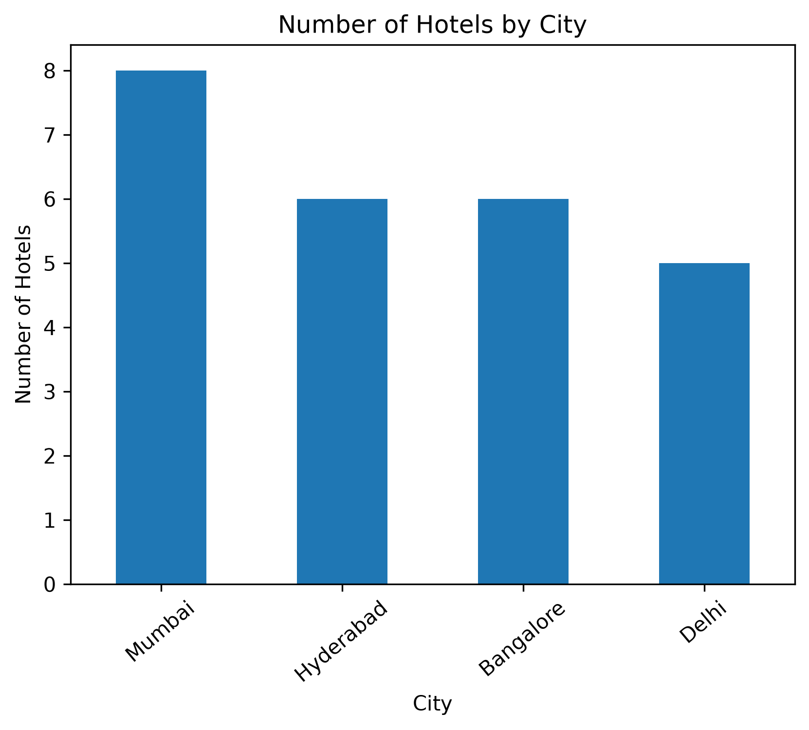
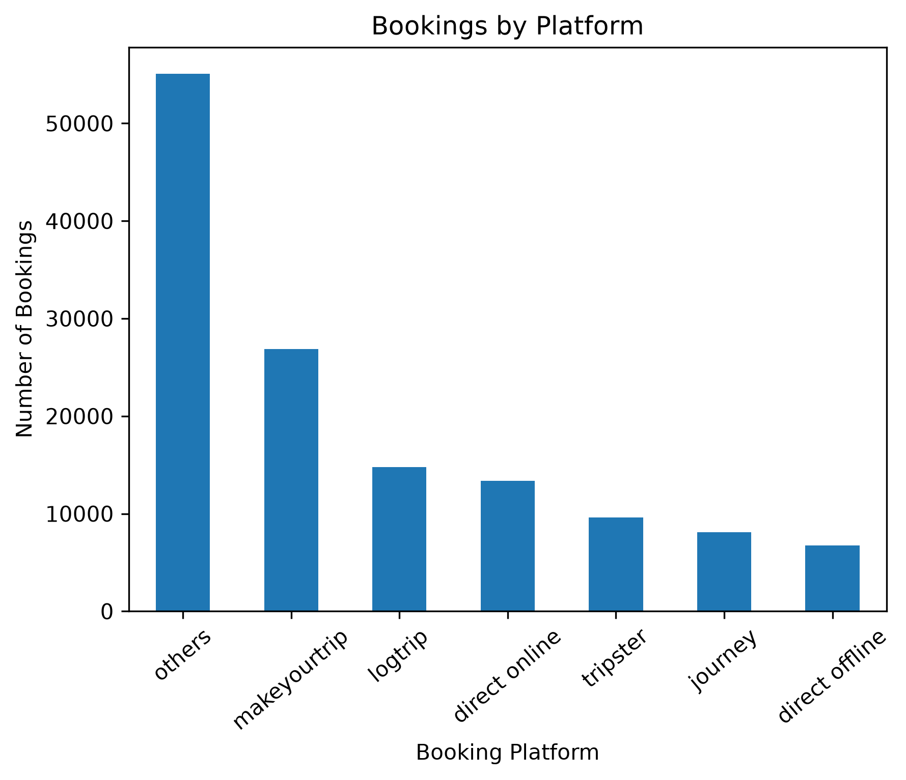
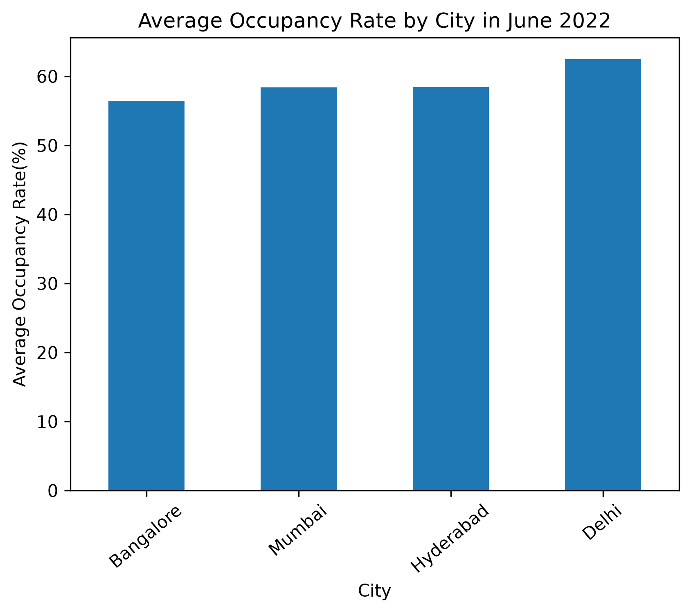
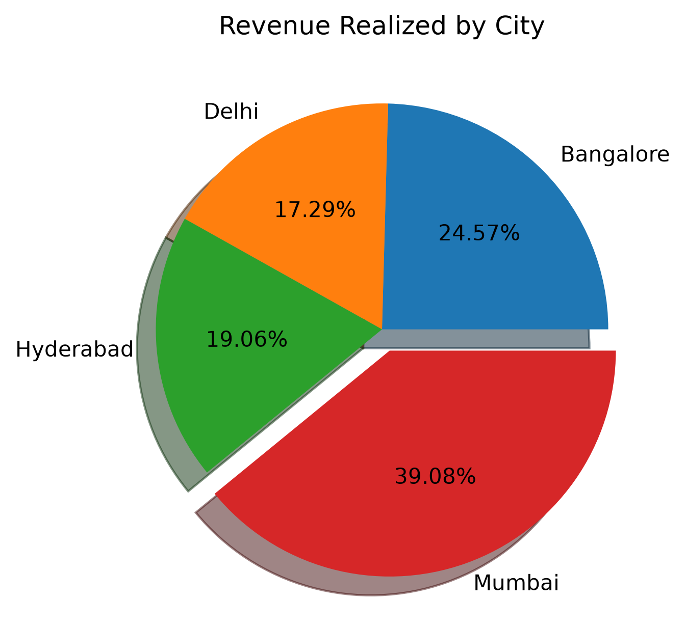
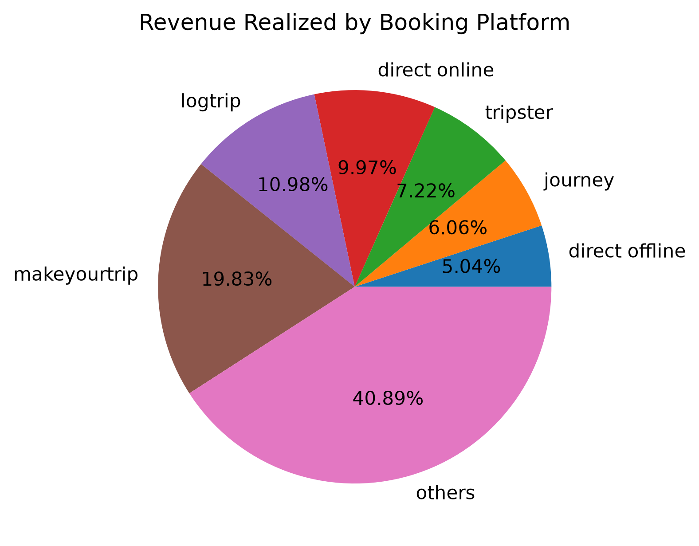
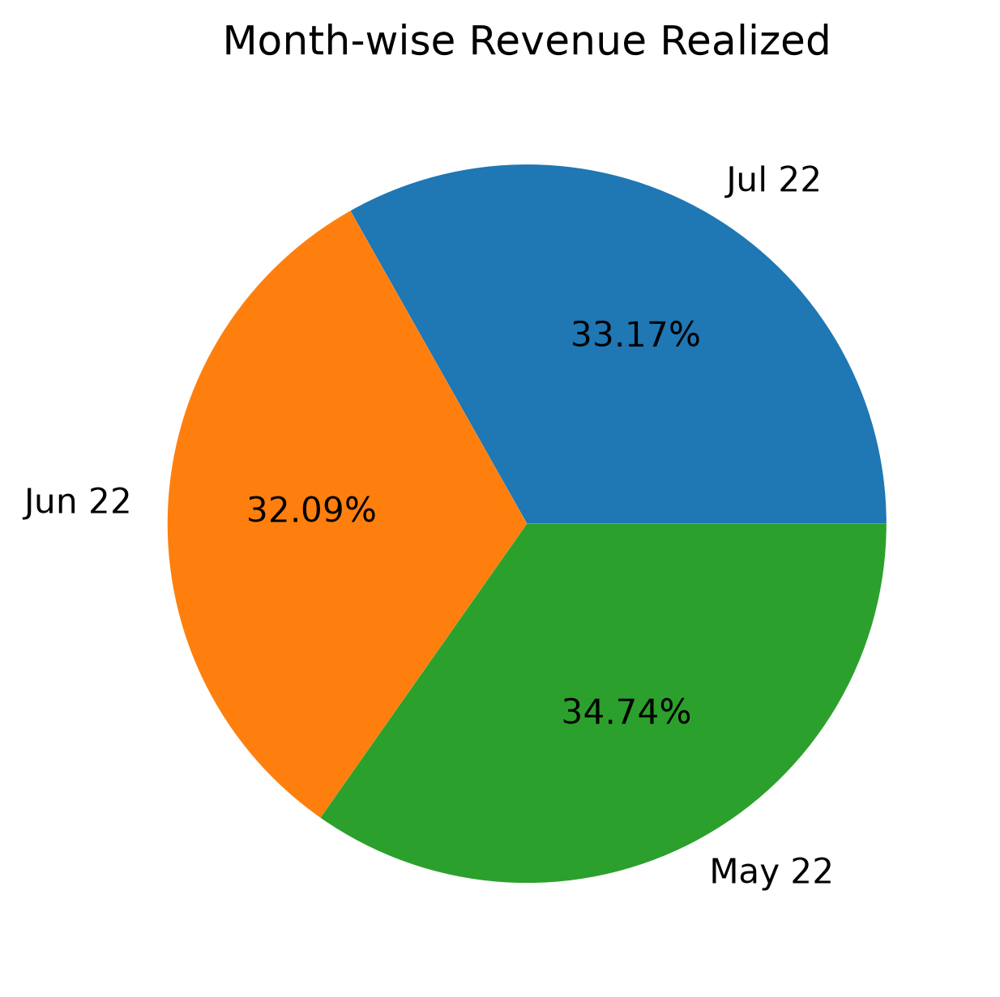

# Hospitality-Data-Analysis

## Project Overview

This project focuses on performing Exploratory Data Analysis (EDA) on the Hospitality dataset using Python. The objective is to analyze booking patterns, occupancy trends, revenue performance, room categories, and customer ratings to generate meaningful business insights.

## Problem Statement

The hospitality industry generates a large volume of booking and revenue data. Through this project, I analyzed the dataset to identify booking trends, capacity utilization, revenue distribution, and data quality issues that could support better business decisions.

## Tools & Libraries Used

- **Python** Core programming language
- **Pandas** Data cleaning, transformation, and analysis
- **Matplotlib** Data visualization
- **Jupyter Notebook** Interactive analysis and documentation

## Key Insights

RT4 (Presidential Suite) rooms generally have higher revenue. No significant outliers were found in the revenue_realized column. A large number of customer ratings were missing, so I retained those records to avoid excessive data loss. Some booking records exceeded the available capacity and were removed during data cleaning.

## Visualization

### Distribution of Hotels by City

### Bookings by Platform

### Average Occupancy Rate by City (June 2022)

### Revenue Realized by City

### Revenue Contribution by Booking Platform

### Month-Wise Revenue Realized

## Data Cleaning Performed

Handled missing values in the capacity column using the median value. Identified and removed records where successful_bookings exceeded capacity. Checked for outliers in the revenue_realized column. Converted and standardized date columns. Verified data consistency across room categories.

## Conclusion

This project demonstrates my ability to perform data cleaning, exploratory data analysis, visualization, and insight generation using Python and Pandas. It is my first end-to-end EDA project in the hospitality domain and an important step in building my data analytics portfolio.
